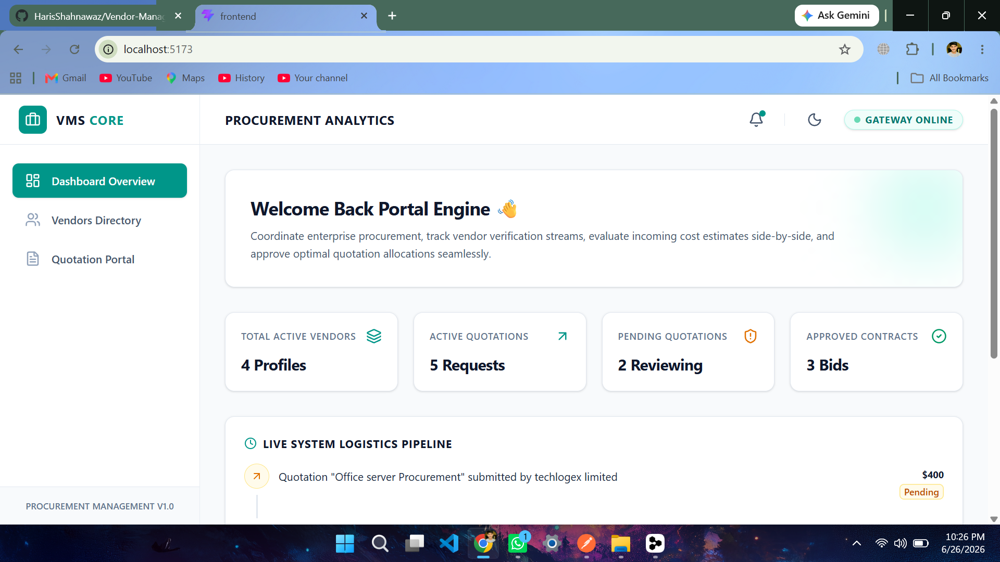
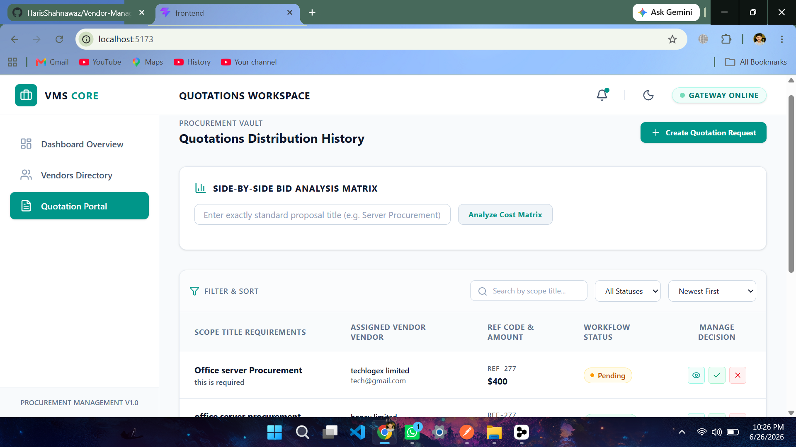
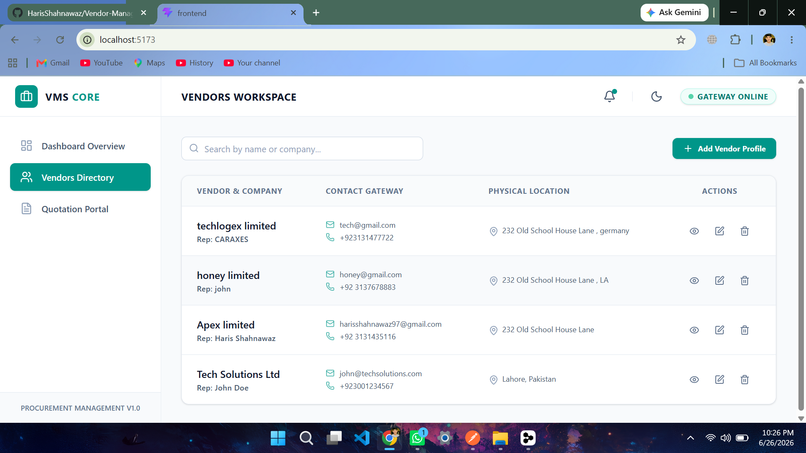

# 🛍️ Vendor Management & Quotation System

A full-stack web application for managing vendors, creating quotation requests, and comparing vendor proposals through a centralized platform.



A modern, full-stack enterprise dashboard application built with React, Node.js, Express, and MongoDB.

---

## 🚀 Features

### Vendor Management
- ✅ Add new vendors with comprehensive profiles
- ✅ View detailed vendor information
- ✅ Edit existing vendor profiles
- ✅ Delete vendors with confirmation
- ✅ Search and filter vendors by name or company

### Quotation Management
- ✅ Create quotation requests
- ✅ Assign quotations to specific vendors
- ✅ Submit quotation responses
- ✅ Update quotation status (Pending/Approved/Rejected)
- ✅ View complete quotation history

### Dashboard Analytics
- ✅ Total Vendors count
- ✅ Active Quotations tracking
- ✅ Pending Quotations monitoring
- ✅ Approved Contracts statistics
- ✅ Recent Activities timeline

### Quotation Comparison
- ✅ Side-by-side bid analysis matrix
- ✅ Display quotation summaries
- ✅ Highlight most cost-effective option
- ✅ Track quotation status across vendors

### User Experience
- ✅ Responsive design (mobile & desktop)
- ✅ Dark/Light theme toggle
- ✅ Real-time online/offline status
- ✅ Smooth animations and transitions
- ✅ Form validation with error feedback
- ✅ Clean and modern UI

## 📷 Screenshots

| Dashboard | Quotation Form | Vendor Management |
| :---: | :---: | :---: |
|  |  |  |

---
## 🛠️ Technology Stack

### Frontend
- **React 19.2.6** - UI library
- **Vite 8.0.12** - Build tool and dev server
- **Tailwind CSS v4.3.1** - Styling framework
- **Lucide React** - Icon library

### Backend
- **Node.js** - Runtime environment
- **Express.js** - Web framework
- **MongoDB** - Database
- **Mongoose** - ODM for MongoDB

## 📋 Prerequisites

Before running this application, ensure you have:

- Node.js (v18 or higher)
- MongoDB (installed and running)
- npm or yarn package manager

## 🛠️ Installation

### Backend Setup

1. Navigate to the backend directory:
```bash
cd backend
```

2. Install dependencies:
```bash
npm install
```

3. Configure environment variables:
Create a `.env` file in the backend directory:
```env
PORT=5000
MONGODB_URI=mongodb://localhost:27017/vendor-management
```

4. Start the backend server:
```bash
npm run dev
```

The backend will run on `http://localhost:5000`

### Frontend Setup

1. Navigate to the frontend directory:
```bash
cd frontend
```

2. Install dependencies:
```bash
npm install
```

3. Start the development server:
```bash
npm run dev
```

The frontend will run on `http://localhost:5173`

## 📁 Project Structure

```
Vender-Management-System/
├── backend/
│   ├── controllers/
│   │   ├── vendorController.js
│   │   ├── quotationController.js
│   │   └── dashboardController.js
│   ├── models/
│   │   ├── Vendor.js
│   │   └── Quotation.js
│   ├── routes/
│   │   ├── vendorRoutes.js
│   │   ├── quotationRoutes.js
│   │   └── dashboardRoutes.js
│   ├── .env
│   ├── package.json
│   └── server.js
└── frontend/
    ├── src/
    │   ├── components/
    │   │   ├── Layout.jsx
    │   │   ├── VendorsList.jsx
    │   │   ├── VendorForm.jsx
    │   │   ├── ViewVendorModal.jsx
    │   │   ├── QuotationList.jsx
    │   │   ├── QuotationForm.jsx
    │   │   └── ViewQuotationModal.jsx
    │   ├── App.jsx
    │   ├── index.css
    │   └── main.jsx
    ├── package.json
    └── vite.config.js
```

## 🗄️ Database Schema

### Vendor Model
```javascript
{
  name: String (required),
  companyName: String (required),
  email: String (required, unique),
  contactNumber: String (required),
  address: String (required),
  createdAt: Date,
  updatedAt: Date
}
```

### Quotation Model
```javascript
{
  title: String (required),
  description: String (required),
  vendorReference: String (required),
  quotationAmount: Number (required),
  submissionDate: Date,
  status: String (enum: ['Pending', 'Approved', 'Rejected']),
  vendorId: ObjectId (ref: 'Vendor'),
  createdAt: Date,
  updatedAt: Date
}
```

## 🔌 API Endpoints

### Vendor Routes
- `POST /api/vendors` - Create new vendor
- `GET /api/vendors` - Get all vendors (with search)
- `PUT /api/vendors/:id` - Update vendor
- `DELETE /api/vendors/:id` - Delete vendor

### Quotation Routes
- `POST /api/quotations` - Create quotation
- `GET /api/quotations` - Get all quotations
- `PUT /api/quotations/:id` - Update quotation
- `DELETE /api/quotations/:id` - Delete quotation

### Dashboard Routes
- `GET /api/dashboard/stats` - Get dashboard statistics

## 🎨 Features Usage

### Adding a Vendor
1. Navigate to "Vendors Directory" tab
2. Click "Add Vendor Profile" button
3. Fill in the form with vendor details
4. Click "Save Profile"

### Editing a Vendor
1. Navigate to "Vendors Directory" tab
2. Click the Edit (pencil) icon on any vendor row
3. Modify the vendor information
4. Click "Update Profile"

### Creating a Quotation
1. Navigate to "Quotation Portal" tab
2. Click "Create Quotation Request" button
3. Fill in quotation details and select a vendor
4. Click "Submit Quotation"

### Comparing Quotations
1. Navigate to "Quotation Portal" tab
2. Use the "Side-by-Side Bid Analysis Matrix" section
3. Enter the exact proposal title
4. Click "Analyze Cost Matrix"
5. View comparison with highlighted lowest bid

### Dark Mode Toggle
- Click the Sun/Moon icon in the header to switch between light and dark themes

## 🧪 Testing

The application includes:
- Form validation with error messages
- Email format validation
- Required field validation
- API error handling
- User feedback for all actions

## 📝 Build for Production

### Frontend
```bash
cd frontend
npm run build
```

### Backend
The backend is production-ready with:
- Environment variable configuration
- Error handling middleware
- CORS configuration
- MongoDB connection management

## 🚀 Deployment

### Frontend Deployment
Deploy the `frontend/dist` folder to any static hosting service:
- Vercel

### Backend Deployment
Deploy the backend to any Node.js hosting service:
- Railway
- Render


Ensure to set environment variables in production:
- `PORT`
- `MONGODB_URI`
- `NODE_ENV=production`


## 📄 License

This project is for educational purposes.

## 👨‍💻 Author

Haris-Shahnawaz

---

**Note:** The CSS lint warnings for `@theme` and `@variant` are expected in Tailwind CSS v4 and will not affect functionality. These are Tailwind v4 specific directives that the CSS linter may not recognize yet.
